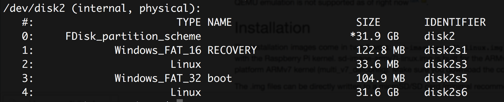

# Raspberry Pi and NixOS

Today I want to try out how to set up my old Raspberry Pi and put NixOS on it. I want to try out that system since last 
year, but never came around to do it. Since someone at the chaos congress took about 3 hours explaining NixOS to me, I 
at least felt guilty enough to really check it out at some point.

This blogpost marks the day: I finally start the journey into NixOS. A lot deeper than just going on the webpage, which 
is aptly named [nixos.org](nixos.org). Let's see how far I get.

## Setting up the SD card for the Pi

I already set up that Raspberry Pi a few years back. First thing to do is set up an SD card with an image so the 
Raspberry boots right into a more or less usable system. Thankfully I remember that Raspberry Pis do not use the same 
CPU architecture than Intel/AMD PCs, so my first search is [nixos raspberry pi 
!g](https://duckduckgo.com/?q=nixos+raspberry+pi+!g).

[NixOS on ARM Wiki](https://nixos.wiki/wiki/NixOS_on_ARM) sounds like a good resource to find out how to set it up. 
Okay, obviously there are a bunch of Raspberry Pi models nowadays and I need to find out my model to use the correct 
image. Otherwise I will most probably be running around the house, searching for display and keyboard to debug it on the
small Pi and find out that it doesn't even start. I don't want this to happen again, so maybe I can do it on the first 
try this time.

I really have trouble keeping a straight face. We all know that something like this never works without trouble for the 
first try. But hey, optimism for the win.

Good, lets find a way to identify my Raspberry Pi model and see what image we need. Google probably already knows what I
own, so the search term is an optimistic [which raspberry pi do i 
own](https://encrypted.google.com/search?hl=de&q=which%20raspberry%20pi%20do%20i%20own). The first result for me is 
[this page](https://www.element14.com/community/docs/DOC-78141/l/identifying-your-model-of-raspberry-pi) which I 
definitely will not link in a SEO friendly way by referring to it as "this page". It lets me have a glance at a table 
that contains the needed information, but creates an overlay right away telling me to "register" and be a member of a 
community I never heard of. Surely I could become one, but why do I have to give them an e-mail address if Google can 
read the necessary information just by being a search engine? I should be able to read that information myself as well, 
right?! I am happy that I know how to access it super easy through the developer console. If they really don't want me 
to read something, they need to keep it out of the code. They have the possibility to keep the information for 
themselves, but if they write it on my own computer...

Okay, so my Pi has 2 USB ports, obviously it has to be a simple Raspberry Pi Model B from the data I extracted from that
page. Let's hope this information is correct, I'll just try it and debug later if there is need to. The image is 1.6GB 
and [the sd-image-armv6l-linux.img link on this Apache directory 
listing](https://www.cs.helsinki.fi/u/tmtynkky/nixos-arm/installer/).

Next step: Write the image on the SD card. Put it into the SD card slot and identify the correct disc. And if you still
have a Mac Book with an SD card reader like me: Feel good that you did not get one without that. `diskutil list` in the
terminal yields this information:

[](raspberry-pi-nix-os/diskutil-list.png)

I don't care what we had on it before, so I can just format it using the program "Disk Utility" on the Mac. `exFat` and 
`Master Boot Record` sound like the options I want as OS X related is always troublesome with linux and MS Dos (FAT) 
just sounds "too old". Who knows, maybe "exFAT" is older than "FAT", but I'm actually just too lazy to use a search 
engine now.

To put the image file on the SD card, I will use this command:

```bash
sudo dd if=/Users/joern/Downloads/sd-image-armv6l-linux.img of=/dev/rdisk2s1
``` 

Using the `/dev/rdisk2s1` is a lot better than `/dev/disk2s1` as it uses the "raw" disk if I remember correctly. If you 
don't use `r` before the disk/partition name, you will have to wait a LOT longer until writing to it finishes. I 
wouldn't want to waste so much time. It still takes a few minutes but in my memory, it took an hour or so not using `r`.

## Thinking about testing the SD card on the Pi

Okay, so the SD card should be set up after the command finished. I have an ethernet cable connected to the Pi and a 
DHCP server running on the network. I really hope it just starts up and I have the possibility to connect to it 
through SSH right away. The more I think about it while the SD card is still being written, the more I think this won't 
be the case. For sure, I need to install `sshd` before I can use it. Why should NixOS preinstall it? Let's see what I 
need to do: I need a (USB) keyboard and a (HDMI) display. There is a beamer right next to me and a keyboard at the PC 
that I didn't turn on since weeks.

It would be great to not need anything else. I should probably have a look into how to build an image myself at some 
point. With sshd preinstalled. Who needs keyboards and displays on a Raspberry Pi anyways? It would make sense, 
especially if I want to use it as a mini-pc in some embedded things that I put into my house.

Actually, I want to set up the Raspberry Pi just because I want to start programming skills for the Alexa I won at a 
recent hackathon and I'm not even sure if that works, building a webserver only available in a local area network and 
(hopefully) not reachable by some Amazon server outside of my network. I don't want to search that information yet, as I
still want to try out NixOS and I would probably stop right away when it isn't. Let me keep hope and see how far I can 
get with my little Pi.

By now, writing to the SD card still hasn't finished. I will take a short(?) break by playing a bit. Hopefully I will 
come back here later and finish the post and trying out the SD card on the Pi.
