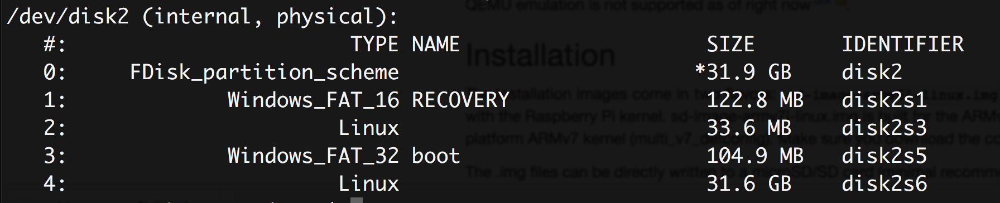

# Raspberry Pi and NixOS

Today I want to try out how to set up my old Raspberry Pi and put NixOS on it. I want to try out that system since last 
year, but never came around to do it. Since someone at the chaos congress took about 3 hours explaining NixOS to me, I 
at least felt guilty enough to really check it out at some point.

This blogpost marks the day: I finally start the journey into NixOS. A lot deeper than just going on the webpage, which 
is aptly named [nixos.org](nixos.org). Let's see how far I get.

## Setting up the SD card for the Pi

I already set up that Raspberry Pi a few years back. First thing to do is set up an SD card with an image so the 
Raspberry boots right into a more or less usable system. Thankfully I remember that Raspberry Pis do not use the same 
CPU architecture than Intel/AMD PCs, so my first search is [nixos raspberry pi 
!g](https://duckduckgo.com/?q=nixos+raspberry+pi+!g).

[NixOS on ARM Wiki](https://nixos.wiki/wiki/NixOS_on_ARM) sounds like a good resource to find out how to set it up. 
Okay, obviously there are a bunch of Raspberry Pi models nowadays and I need to find out my model to use the correct 
image. Otherwise I will most probably be running around the house, searching for display and keyboard to debug it on the
small Pi and find out that it doesn't even start. I don't want this to happen again, so maybe I can do it on the first 
try this time.

I really have trouble keeping a straight face. We all know that something like this never works without trouble for the 
first try. But hey, optimism for the win.

Good, lets find a way to identify my Raspberry Pi model and see what image we need. Google probably already knows what I
own, so the search term is an optimistic [which raspberry pi do i 
own](https://encrypted.google.com/search?hl=de&q=which%20raspberry%20pi%20do%20i%20own). The first result for me is 
[this page](https://www.element14.com/community/docs/DOC-78141/l/identifying-your-model-of-raspberry-pi) which I 
definitely will not link in a SEO friendly way by referring to it as "this page". It lets me have a glance at a table 
that contains the needed information, but creates an overlay right away telling me to "register" and be a member of a 
community I never heard of. Surely I could become one, but why do I have to give them an e-mail address if Google can 
read the necessary information just by being a search engine? I should be able to read that information myself as well, 
right?! I am happy that I know how to access it super easy through the developer console. If they really don't want me 
to read something, they need to keep it out of the code. They have the possibility to keep the information for 
themselves, but if they write it on my own computer...

Okay, so my Pi has 2 USB ports, obviously it has to be a simple Raspberry Pi Model B from the data I extracted from that
page. Let's hope this information is correct, I'll just try it and debug later if there is need to. The image is 1.6GB 
and [the sd-image-armv6l-linux.img link on this Apache directory 
listing](https://www.cs.helsinki.fi/u/tmtynkky/nixos-arm/installer/).

Next step: Write the image on the SD card. Put it into the SD card slot and identify the correct disc. And if you still
have a Mac Book with an SD card reader like me: Feel good that you did not get one without that. `diskutil list` in the
terminal yields this information:

[](diskutil-list.png)

I don't care what we had on it before, so I can just format it using the program "Disk Utility" on the Mac. `exFat` and 
`Master Boot Record` sound like the options I want as OS X related is always troublesome with linux and MS Dos (FAT) 
just sounds "too old". Who knows, maybe "exFAT" is older than "FAT", but I'm actually just too lazy to use a search 
engine now.

To put the image file on the SD card, I will use this command:

```bash
sudo dd if=/Users/joern/Downloads/sd-image-armv6l-linux.img of=/dev/rdisk2s1
``` 

Using the `/dev/rdisk2s1` is a lot better than `/dev/disk2s1` as it uses the "raw" disk if I remember correctly. If you 
don't use `r` before the disk/partition name, you will have to wait a LOT longer until writing to it finishes. I 
wouldn't want to waste so much time. It still takes a few minutes but in my memory, it took an hour or so not using `r`.

## Thinking about testing the SD card on the Pi

Okay, so the SD card should be set up after the command finished. I have an ethernet cable connected to the Pi and a 
DHCP server running on the network. I really hope it just starts up and I have the possibility to connect to it 
through SSH right away. The more I think about it while the SD card is still being written, the more I think this won't 
be the case. For sure, I need to install `sshd` before I can use it. Why should NixOS preinstall it? Let's see what I 
need to do: I need a (USB) keyboard and a (HDMI) display. There is a beamer right next to me and a keyboard at the PC 
that I didn't turn on since weeks.

It would be great to not need anything else. I should probably have a look into how to build an image myself at some 
point. With sshd preinstalled. Who needs keyboards and displays on a Raspberry Pi anyways? It would make sense, 
especially if I want to use it as a mini-pc in some embedded things that I put into my house.

Actually, I want to set up the Raspberry Pi just because I want to start programming skills for the Alexa I won at a 
recent hackathon and I'm not even sure if that works, building a webserver only available in a local area network and 
(hopefully) not reachable by some Amazon server outside of my network. I don't want to search that information yet, as I
still want to try out NixOS and I would probably stop right away when it isn't. Let me keep hope and see how far I can 
get with my little Pi.

By now, writing to the SD card still hasn't finished. I will take a short(?) break by playing a bit. Hopefully I will 
come back here later and finish the post and trying out the SD card on the Pi.

## Testing NixOS on Pi

The SD card is finally written and I can `diskutil unmountDisk disk2` to unmount all volumes and get it out of my 
laptop. And, as expected, it doesn't work out. Debugging with display and keyboard yields... no display! Great, so the
Raspberry Pi doesn't seem to start up correctly or as I wished it would.  

Let's fast forward a few hours, since I just played around with different settings while watching a TV show with a lot 
of commercial breaks: I've tried FAT, exFAT, different blocksizes, like `bs=1m` and doing everything to see that this 
`dd` approach did not work out as I thought it should after it worked so great with a USB stick on a different occasion 
with a different OS. 

I think the best way to go forward now is to do the tutorial on the Raspberry Pi page, install NOOBS on the SD card and
see if the Pi itself generally works and I am using the wrong settings. While doing the tutorial, that means, 
downloading some obscure SD card formatter, which I could also do with Disk Utility, I could copy the freshly downloaded
NOOBS Lite version on the card. It works! Okay, so now I'm the one looking stupid. Obviously my configuration settings
were wrong the whole time.

First of all, I need to format the SD card with FAT, that's what I've been told from the NOOBs tutorial. Then I need to
see how to get the `.img` file on the disk without breaking anything. Maybe the blocksize stuff can break something? I
need to learn a bit more now. I will use the official formatting tool now as it might be that the "Master boot record"
setting is also not what I need. The NOOBs tutorial does not say anything about it, so I am better off using the tools
presented in a way that I can't really make any mistakes anymore. 

Okay, so it happens to be a completely stupid problem I had when using `dd`: The `.img` file is a real image, containing
partitions and everything that is needed to set up a whole SD card. Since it is like that, I do not need to just copy 
the files on the created / formatted partition but on the whole disk. This is kind of embarrassing but also something
that I guess you have to learn. Thankfully I re-read the NixOS wiki about Raspberry Pi setup and saw that they used `dd`
on `/dev/sdc`, not `/dev/sdc1` for example. Otherwise I probably wouldn't have tried that out.

Great, took me just under a day, but I am greeted with a `nixos login: root (automatic login)` and a shell. I'm proud of
myself now and need to take a short break after about 20 different reformats of the SD card. I also need to check out if
the second HDMI cable works that I have here so I can easily switch between the Pi and my gaming console on the beamer.
You need to have priorities, right?

And even better: The second HDMI cable works! I can switch between sources and greatly improve my experience: Play while
waiting for something to finish on the Pi. The only problem is: I don't really need it anymore, as soon as I start using
`sshd` for a remote login and just use my laptop for it. Then I have two screens: One for gaming and one for working on 
the Pi! Oh well, if I really try to create an image from the SD card with `sshd` preinstalled, I might need it. But for 
now, let's find out how to actually use nixos and see how to install `sshd`.

## Using nixos

I don't like the external keyboard and sitting with it on a couch. A laptop gives me a much smoother experience. So the
next step really to be set up a remote login. SSH is as far as I know the more or less best option out there. Well 
tested, probably as old as computers exist and you have a complete shell which you can use to do almost anything.

Start the manual! First thing I read is I need to do the installation first. But hey, it also tells me that the 
installation medium has already `sshd` preinstalled. So I don't even need to install anything, it's already there! Cool!
Let's try that. First I need to setup a password using `passwd` on the Pi. Then I need to enter `systemctl start sshd`.
And on the first try, as soon as that command finished, I was able to connect from my Macbook! What a great experience,
not having to care too much about hardware and just keep staying in the software world...!

To recap, I needed the keyboard for three commands actually:

1. `ip a` - to check the IP address
2. `passwd` - to set a password that I can use to login from my Mac
3. `systemctl start sshd` - to start `sshd` and be able to remote login

Actually that is everything why I needed a keyboard and a display for. That has to be scriptable. At some point. In the
future.

## Installing things

I sincerely hope I can skip the filesystem stuff as I should only have the SD card on the Pi and no "real" other storage 
on it. At least I guess from the output of `fdisk -l`, I think it should be okay. A boot record and a drive formatted as
"Linux". Let's see how far we get.

Since I could not find a `hardware-configuration.nix` file in `/etx/nixos/`, I guess I need to start with the 
installation using `nixos-generate-config`. This worked out and I could even reboot the Pi with it still having that 
newly created file. `sshd` did not come up though, even when I tried `systemctl enable sshd` - it looks like it does not
want to be enabled by default and I guess this is actually wanted that it doesn't  always start up. I should have a look
into that later as my cool "switch source" setup is still intact and I just need the keyboard for opening up the remote
login whenever I reboot. That's okay for me right now. 

Next step is to enter `nixos-install`, let's see where this goes.

Nowhere actually, as it wants to find a `/mnt/etc/nixos/configuration.nix` file. So I could try to find the information 
if the Pi image already is "installed" or not. Obviously I choose not to check and I just type in the command 
`mount /dev/disk/by-label/NIXOS_SD /mnt` to get in a similar state like the manual. What can possibly go wrong, eh?

I've removed something about a raspberrypi-installer package and just kept this in my configuration:

```bash
[root@nixos:~]# cat /mnt/etc/nixos/configuration.nix 
{ config, pkgs, ... }:

{
  imports =
    [ # Include the results of the hardware scan.
      ./hardware-configuration.nix
    ];

  # Enable the OpenSSH server.
  services.sshd.enable = true;
}

[root@nixos:~]# cat /mnt/etc/nixos/hardware-configuration.nix 
# Do not modify this file!  It was generated by ‘nixos-generate-config’
# and may be overwritten by future invocations.  Please make changes
# to /etc/nixos/configuration.nix instead.
{ config, lib, pkgs, ... }:

{
  imports =
    [ <nixpkgs/nixos/modules/installer/scan/not-detected.nix>
    ];

  boot.initrd.availableKernelModules = [ "usbhid" ];
  boot.kernelModules = [ ];
  boot.extraModulePackages = [ ];

  fileSystems."/" =
    { device = "/dev/disk/by-uuid/44444444-4444-4444-8888-888888888888";
      fsType = "ext4";
    };

  swapDevices = [ ];

  nix.maxJobs = lib.mkDefault 1;
  powerManagement.cpuFreqGovernor = lib.mkDefault "ondemand";
}

```

A `nixos-install` then yields:

```
error: The unique option `powerManagement.cpuFreqGovernor' is defined multiple times, in `/mnt/etc/nixos/hardware-configuration.nix' and `/nix/store/n11a6d0bvikgv9d9dy2zkvh8c5n7mh25-nixos-18.03.git.aeff3080d0/nixos/nixos/modules/config/power-management.nix'.
(use ‘--show-trace’ to show detailed location information)
``` 

Obviously that wasn't the best idea. And another stupid mistake I made is that I didn't at least took a screenshot from
old `configuration.nix` file. Ouch, that's why I need to reboot again, with hope to get an old version of the 
`configuration.nix` file again. Let's see how that works out... turns out it doesn't give me the old version back. A 
quick search on the internet doesn't really help, so I'll just clone the SD card again and start over. Nothing really
happened, right? Just another hour elapsed again thanks to not reading the documentation too much... :)

Well, well, well. After another retry I think it might not be the best idea to try the nixos-install. When I did, the 
system crashed with a not so nice error message and without being responsive to any kind of keyboard input. It looks 
like it really has trouble detecting hardware as suggested by the strange `hardware-configuration.nix` that got 
generated before. Or something completely different.

I could see that using `nixos-rebuild` worked and it booted into the new configuration - I hope - when I restarted. I
think I just might not need to do the install stuff at all. We will see how this works out.

## Starting up sshd on every reboot

Using systemd enable sshd does not work by itself. Putting it into `configuration.nix` with the line 
`services.sshd.enable = true;` and do a `nixos-rebuild switch` also resulted in an inactive / non-running sshd daemon.
There has to be something else to do to get it starting up on reboot. Otherwise I always have to use an external display
and keyboard, whenever I reboot / poweroff the Pi. And I thought I'd only switch it on on-demand, so it really should
start up something like SSH. Not sure now what to do, I will have a closer look into the documentation and try to get 
some ideas...

In the meantime I found the real [installation instructions for the Raspberry 
Pi](https://nixos.wiki/wiki/NixOS_on_ARM#NixOS_installation_.26_configuration). Over there I can read that I really 
should use just `nixos-rebuild` instead of `nixos-install`. So one open question can be closed now. I've copied the
configuration and added something for sshd. After that, running the `nixos-rebuild` with the options given in the wiki
worked quite well.

I added more options than just `services.sshd.enable = true`. Most probably the setting `permitRootLogin` is needed as
long as I don't have a user account set up yet. To do that, I've added the line to `configuration.nix` and saw that 
`nixos-rebuild` worked. 

1. `permitRootLogin` cannot be set due to unique configuration option. `pkgs.libs.mkForce` seems to do the trick. 
2. The port number is now `2223` and the list obviously overwrites the default in this case.

I am unsure, why in one case I need to force set it and in another one I don't need to. I should read that up at some 
point.

