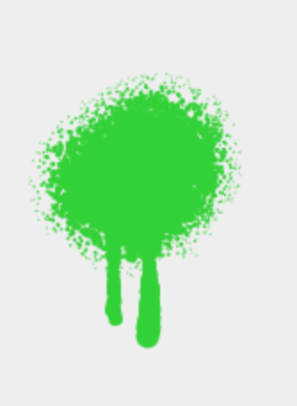

# A spray that drops

In a lot of drawing applications, you find a "spray" or "airbrush" tool. While most of them are actually quite nice to
use, none of what I've seen so far behaves like a real spray can. A real spray can will make color drop down your
canvas if you use it on the same spot for too long.

The [dropping-spray project](https://github.com/Narigo/dropping-spray) wants to change that. Written in JavaScript, you
can use it in your application to create such an effect.

## How does it work?

Like other airbrush tools, it randomly draws circles around your pointer. This is done by reading the coordinates of
the pointer and randomly generating coordinates around it in a circle. The farther away the coordinates are, the
smaller the generated circles will be drawn. Every animation frame, it will generate new random coordinates for as long
as the pointer is pressed on the canvas. This results in a cool effect, which is best shown in pictures:

|  |  |  |
| :---------------------------------------------------: | :--------------------------------------------------: | :----------------------------------------------------: |
|              Pressed for just one frame               |       Pressed for a short time (a few frames)        |                Pressed for a long time                 |

In other applications, the spray can tool works similar and is done. But for us, we still need to generate the drops to
make the tool behave like a real world spray can.

A drop usually occurs, when you spray on the same spot for too long. If you spray just a bit, wait until the color
dries and spray again, it will not generate drops. If you press for a longer time, the drop will get bigger and move
faster.

To simulate this, we need to remember the coordinates where we put color to while we draw. If the coordinates we spray
to count a high enough threshold, we begin generating a (small) drop. If we stop spraying, we reset the information to
have the "color dries up" effect. If we press for an even longer time, the drop gets bigger.

The drop is just a line that flows down a more or less random path to the bottom with a random thickness. If the
thickness is small, the line will be longer, if the thickness is bigger, the drop will stop early - as long as we stop
spraying. The length and thickness is proportional to the amount of color we sprayed on the spot. This can be
calculated by just counting how often (how many frames) the pointer kept drawing on the same coordinates.

## Technical details

While developing this tool, I wondered how to add tests to something that was a "frontend experiment" drawing randomly
on a canvas. The [test-driven development hero Wolfram Kriesing](https://twitter.com/wolframkriesing) made me aware
that drawing and calculating could be separated.

This way, the calculations can be tested if they are done correctly. In addition, there can be different drawing
mechanisms. For example not only a "drawing on canvas" but also using PixiJS instead of native canvas drawing or even
creating an SVG from the shapes that should be drawn while pressing the pointer.

In the [dropping-spray code repository](https://github.com/Narigo/dropping-spray) you can have a look into the real
code and how to use it. There is also an [online demo of a dropping spray](https://narigo.github.io/dropping-spray/)
available.
